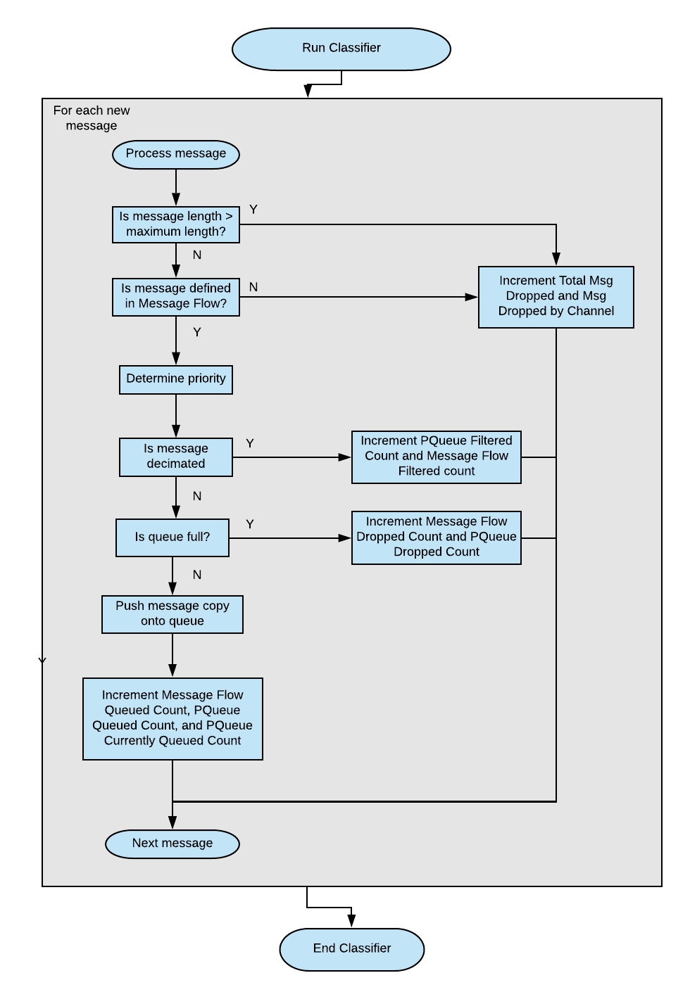
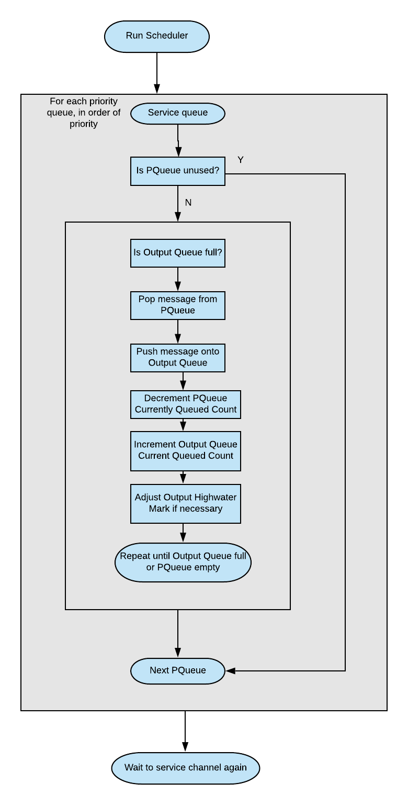
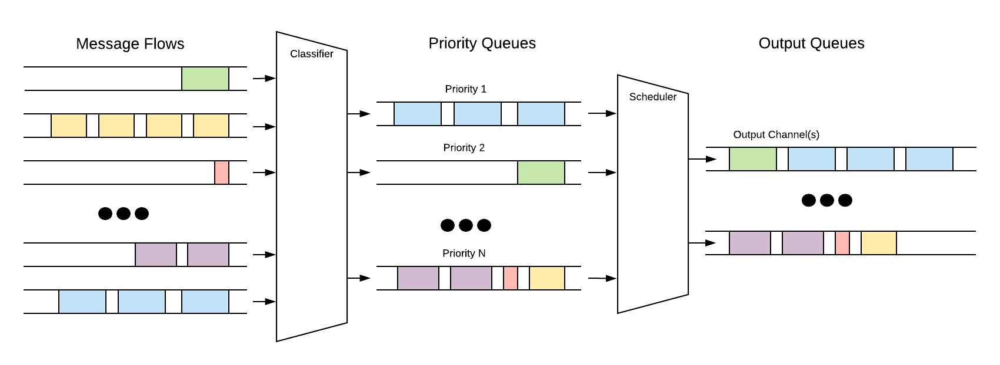

Activities
==========

.. graphviz::
   :caption: TO Executive Diagram
   
   digraph TO_Executive_Diagram {
         
      POINT -> START;
      START -> CLASSIFIER;
      CLASSIFIER -> SCHEDULER;
      SCHEDULER -> END
      
      POINT [shape=point];
      START [style="filled,rounded", fillcolor="#dee1ff", shape=rect, label="Process Telemetry"];
      CLASSIFIER [style=filled, fillcolor="#8fffad", shape=rect, label="Run Classifier"];
      SCHEDULER [style=filled, fillcolor="#8fffad", shape=rect, label="Run Scheduler"];
      END [style="filled,rounded", fillcolor="#dee1ff", shape=rect, label="End"];
      
    }

    

      
   TO Run Classifier

    

      
   TO Run Scheduler
   

      
   TO Priority Queueing
    
    