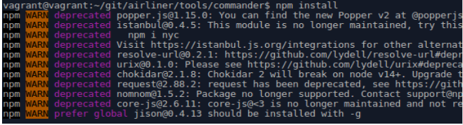
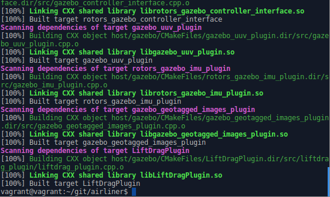
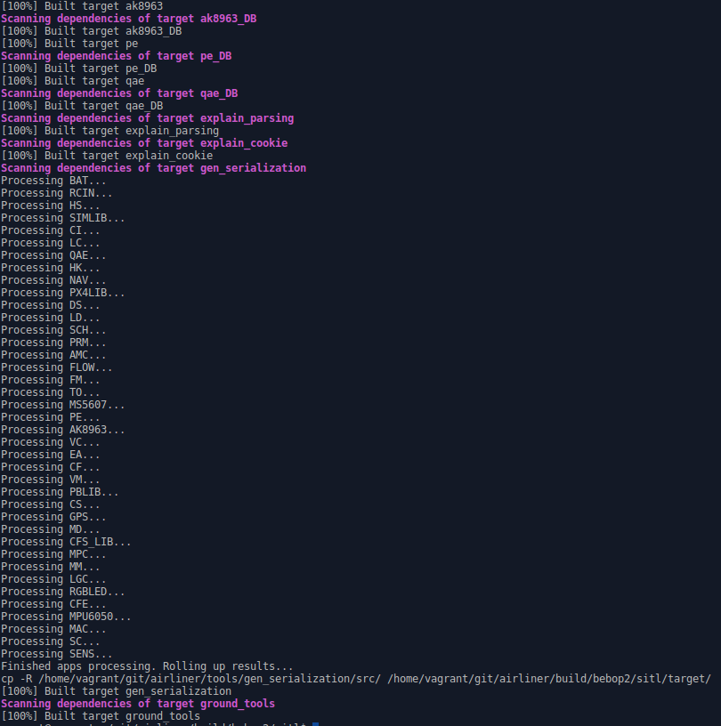
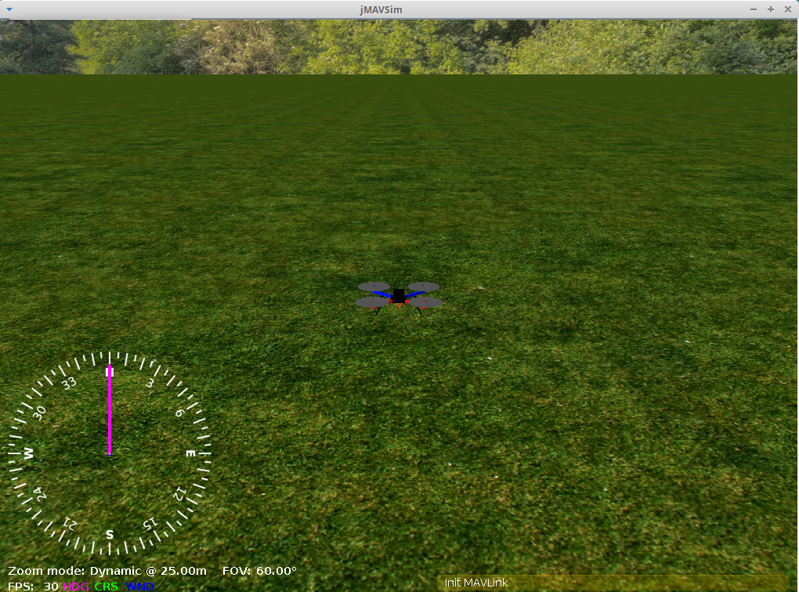
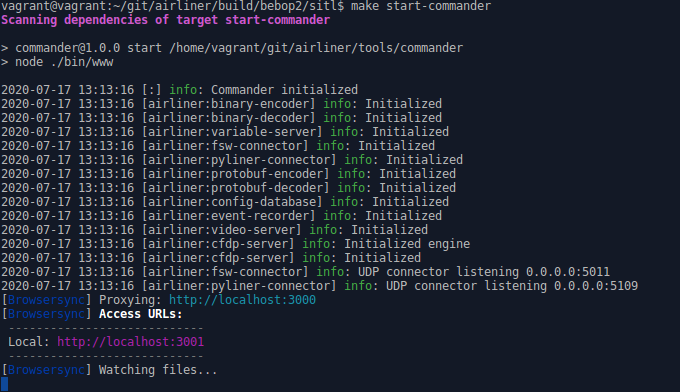
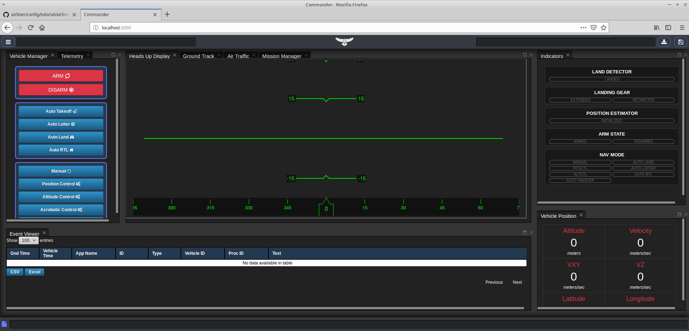
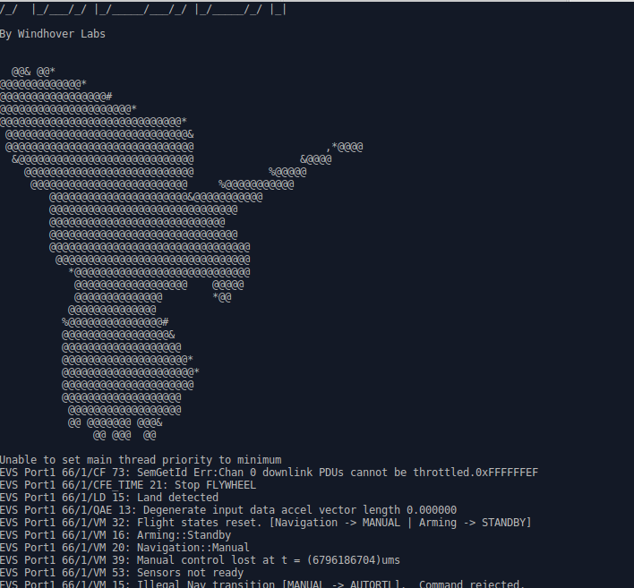

# Airliner Setup in Linux


## Assumptions for the use of Airliner:
* User can navigate Windows Command Prompt
* User is familiar with navigating Linux Shells
* User is comfortable using git and navigating GitHub
* VirtualBox and Vagrant are installed
* VirtualBox is capable of 3D Acceleration for Linux


## Stable Versions known to work with Airliner:
* VirtualBox 6.1.10 
* Vagrant 2.2.9
* Ubuntu 16.04
* Java 11.0.2
* node 9.X

## Assumptions for this README:
* The repository name for Airliner is airliner, denoted as <airliner\>


## VirtualBox setup in Windows:

1. Download [VirtualBox 6.1.10](https://www.virtualbox.org/wiki/Downloads "VirtualBox 6.1.10")
2. Download [Vagrant 2.2.9](https://www.vagrantup.com/downloads "Vagrant 2.2.9") and follow [installation instructions](https://www.vagrantup.com/docs/installation)
2. Within Windows, create a directory for your environment
3. Within that directory perform a `vagrant init`
4. Open the newly generated Vagrantfile in a text editor and uncomment/edit the following: 

```ruby
config.vm.box = "windhoverlabs/workshop"
```

```ruby
config.vm.provider "virtualbox" do |vb|
            # Display the VirtualBox GUI when booting the machine
            vb.gui = true
            # Customize the amount of memory on the VM:
            vb.memory = "<half of system memory is recommended>"
end
```

5. Perform a `vagrant up` at destination of Vagrantfile

**NOTE:** This command must be run **ANY TIME** that you want to boot up the Virtual Machine

## Airliner Initial Install & Setup:
1. [Generate an SSH key](https://docs.github.com/en/github/authenticating-to-github/generating-a-new-ssh-key-and-adding-it-to-the-ssh-agent)

2. [Add a new SSH key to your GitHub Account](https://docs.github.com/en/github/authenticating-to-github/adding-a-new-ssh-key-to-your-github-account)

3. Go to Windhover Lab's [Airliner repository](https://github.com/WindhoverLabs/airliner) and [clone the repository](https://docs.github.com/en/github/creating-cloning-and-archiving-repositories/cloning-a-repository) using an SSH key

4. Get node version managment
```
$ npm install -g n
```

5. Get node 9
```
$ n 9
```
Yes, the command for node version management  is just `n`.

6. Make sure you have the correct version of node. if you run `node --version`, you shold get a similar output to this:
```
v9.11.2
```
 The important part is to have version **9.x**. If you have older versions of node, airliner will not build correctly.
 
7. Once the Airliner repository has been cloned, navigate to <airliner\>/tools/commander directory and preform an `npm install` 
```
$ /<airliner>/tools/commander$ npm install
```
The following npm warnings are expected:



**NOTE:** The previous steps only need to be completed **once** 

8. To show all the options of targets available to make, use command `make` within the <airliner\> directory

The following options are the targets currently available to make:
```shell
$ /<airliner>$ make
bebop2/sitl bebop2/default ocpoc/default ocpoc/quadx shared/cvt_perfids.h tutorial/airliner tutorial/cfs typhoon_h480/sitl reference/default
Specify a target to build.  Available targets are:
bebop2/sitl
bebop2/default
ocpoc/default
ocpoc/quadx
shared/cvt_perfids.h
tutorial/airliner
tutorial/cfs
typhoon_h480/sitl
reference/default
``` 


## Airliner Target Installation & Simulation for bebop2/sitl
1. Within the <airliner\> directory, make the target bebop2/sitl
```shell
$ /<airliner>$ make bebop2/sitl
```

When bebop2/sitl is made successfully, the output should appear as follows:



2. Navigate into the bebop2/sitl directory and `make ground_tools`
```shell
$ /<airliner>/build/bebop2/sitl$ make ground_tools
```

When `make ground_tools` is run successfully, the output should appear as follows:



3. Open three terminals starting at the following location: 
```shell
$ /<airliner>/build/bebop2/sitl$
``` 


### Terminal 1: Simulation

1. Navigate to the host directory
2. **Simulate using Gazebo 8**: At the moment this option is too slow to run in a VM, but feel free to try it 
```shell
$ /<airliner>/build/bebop2/sitl/host$ ./start-gazebo
``` 
3. **Simulate using Jmavsim**: This option should always work 
```shell
$ /<airliner>/build/bebop2/sitl/host$ ./start-jmavsim
``` 

When jmavsim is launced successfully, the simulation should appear as follows:




### Terminal 2: Ground System
1. Make sure you are in the specified location and `make start-commander`
```shell
$ /<airliner>/build/bebop2/sitl$ make start-commander
```

When `make start-commander` is run sucessfully, the output should appear as follows:



2. Open a web browser within Virtual Box and go to [http://localhost:3000](http://localhost:3000 "localhost:3000") for the commander interface 

When the commander interface launced successfully, it should appear as follows:




### Terminal 3: Flight Shell
1. Navigate to the target/exe directory
2. Run airliner
```shell
$ /<airliner>/build/bebop2/sitl/target/exe$ ./airliner
```

When launced successfully, the flight shell should appear as follows:


