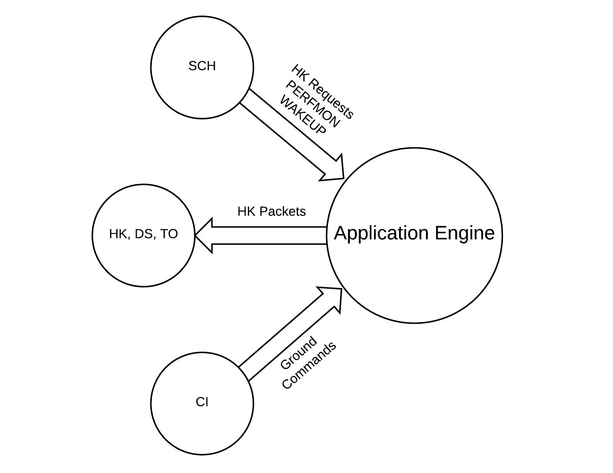

Design
================

TODO Add relevent EA Diagrams.
   

.. graphviz::
   :caption: EA Context Diagram
   
   digraph EA_Context_Diagram {
         
      SCH -> APP [label="HK Requests\nPERFMON\nWAKEUP"];
      APP -> HK [label=" HK Packets"];
      CI -> APP [label="Ground\nCommands"];
       
     
      SCH [style=filled, fillcolor="#f5ffc7", shape=circle, width=1]
      APP [style=filled, fillcolor="#dee1ff", shape=circle, width=1.5, label ="Application Engine"]
      HK [style=filled, fillcolor="#f5ffc7", shape=circle, width=1, label ="HK, DS, TO"]
      CI [style=filled, fillcolor="#f5ffc7", shape=circle, width=1]
      
    }
  

